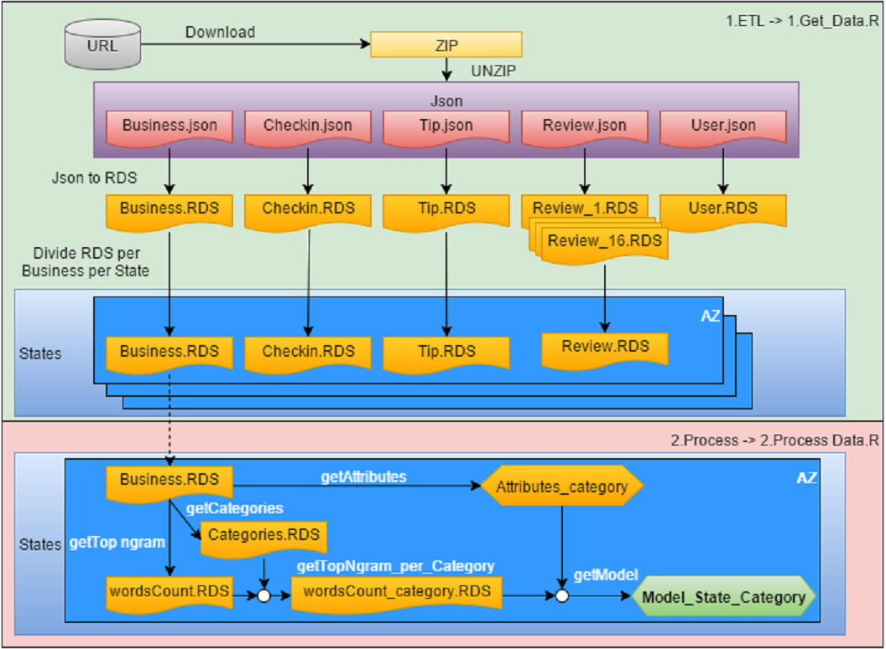
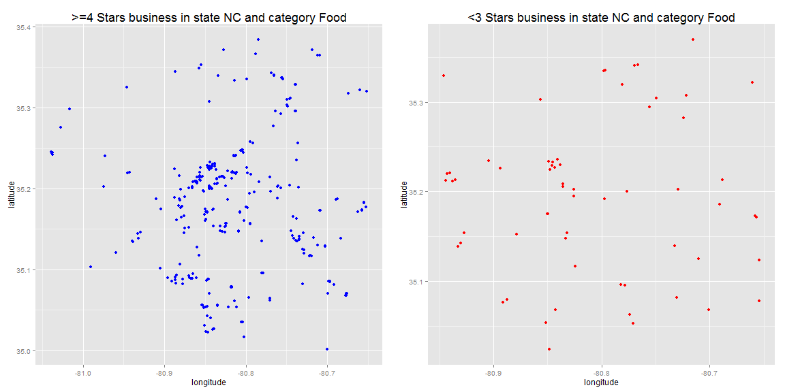

Analysis of relation between Stars rating vs. most relevant Attributes and n-grams (words) in Reviews filtered by State and Category of Business
========================================================
author: Jose Maria Vilaverde
date: November 22th, 2015
transition: rotate
width: 1200
height: 900

Introduction
========================================================

In order to **get top rate as business in a State** is analyzed where have to be **located** my business, which **services** I need to offer, what **positive review words** I need to be associated to my business **and** what **negative review words** I need to avoid.

To do that **analysis** is used as **input Business Category and State**. As **output**: **Top Rate, Location-Neighborhood, Services, Top-5 positive words to promote, Top-5 negative words to avoid**.

For **example**, if I want to open a **business** for **category "dentist" in Arizona**, I need to know where is the **best place to open the business**, **services** that I need to offer to my customers, like "credit card accepted", and **identify** most relevant **positive review words** that I need to get from my customers **and negative review words** for my business category in Arizona.

Methods and Data
========================================================

Results for state "NC" and category "Food"
========================================================

**Map of Business Star rates**

 

**Random Forest Formula**

[1] "Formula: ~starsattributes.Parking.validated + attributes.Ambience.hipster + attributes.Parking.street + attributes.Accepts.Credit.Cards + attributes.Music.live + attributes.Price.Range + attributes.Parking.garage + attributes.Good.For.breakfast + attributes.Takes.Reservations + attributes.Caters + attributes.Good.For.Groups + attributes.Has.TV + attributes.Wheelchair.Accessible + attributes.Ambience.casual + attributes.Good.for.Kids + attributes.Parking.lot + attributes.Good.For.dinner + latitude + longitude"

Discussion
========================================================

**Random Forest Model: Confusion Matrix Overall**

Accuracy | Kappa
---------|-------
0.2824427 | 0.0320704

**Final Conclusion**

Based on this analysis, in one hand, **use of attributes as stars rate predictor and Top-5 positive and negative 1-gram is inefficient**, can't be used to recomend to business owner attributes to have or words that have to make arise in reviews. Maybe is possible to recommend some attributes, but is not confirmed their direct influence in stars rate. In the other hand,  **Map of business can be useful to stablish location of business in a specific category**.

_Please, for detailed information read pdf analysis version._

**Thanks for your attention!**

Github code: https://github.com/jmvilaverde/DataScienceSpecialization-10Capstone

